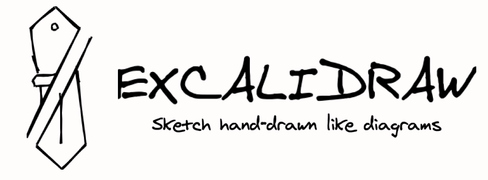
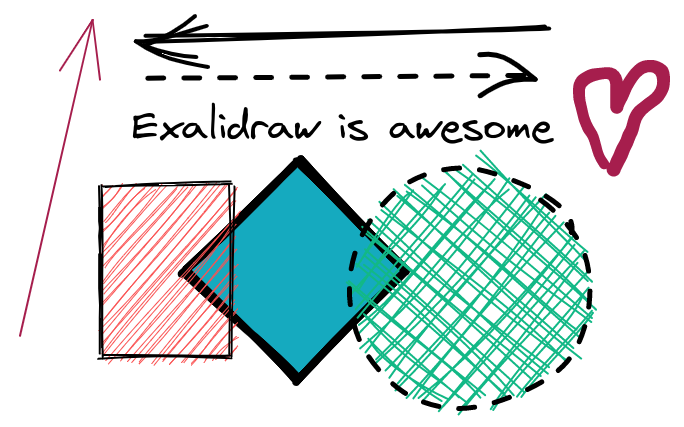

In my journey of working on personal projects, I stumbled upon Excalidraw, an open-source tool for creating diagrams and schemes. It has proven to be an invaluable asset, aiding me in understanding the core problems I aim to solve and devising effective solutions. Documenting my thought process alongside visual representations not only solidifies my understanding but also ensures persistence of my ideas.

<!--more-->

Excalidraw stands out as an intuitive and versatile tool, offering a seamless charting experience without any steep learning curve. Best of all, it's entirely free and accessible without the need for registration. Simply visit the [Excalidraw page](https://excalidraw.com/) and dive right in.

## Collaboration Made Easy

One remarkable feature of Excalidraw is its live collaboration functionality. This enables multiple users to collaborate in real-time on a single whiteboard, enhancing teamwork and communication. While occasional latency issues may arise, the overall experience is commendable.

## VSCode Extension for Seamless Integration

For those who prefer to work within their preferred text editor, Excalidraw offers a convenient VSCode extension known as [Excalidraw Schema Editor](https://github.com/pomdtr/vscode-excalidraw-embed). This extension allows you to manage Excalidraw files directly within your editor, facilitating version control, editing, and comparison just like any other code files.

## In Summary

Excalidraw emerges as a versatile and user-friendly application for creating visually appealing diagrams and collaborating seamlessly. Whether you're sketching out ideas solo or collaborating with a team, Excalidraw empowers you to express your thoughts effectively. Don't hesitate to give it a try and elevate your diagramming experience today!

#### Explore More about Excalidraw

- [Official Excalidraw Website](https://excalidraw.com/)
- [Excalidraw Blog](https://blog.excalidraw.com/)
- [Excalidraw GitHub Repository](https://github.com/excalidraw/excalidraw)
- [Excalidraw VSCode Extension](https://github.com/pomdtr/vscode-excalidraw-embed)
