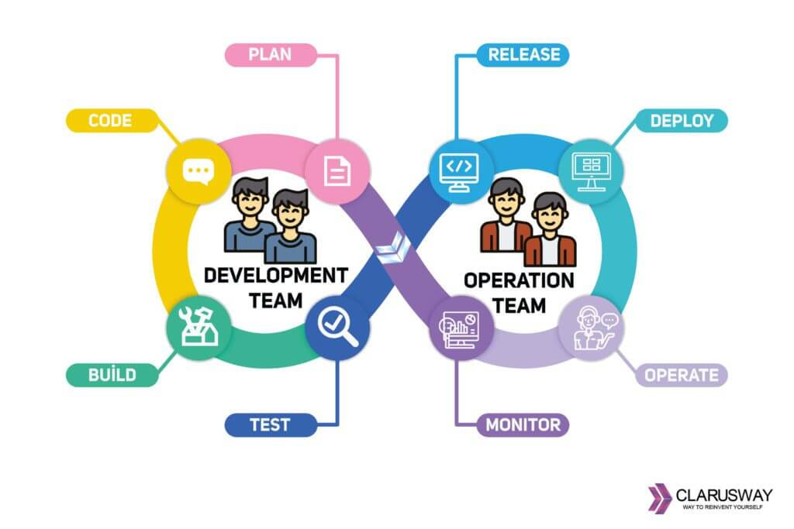



Very intresting concept for an IT book, I have never read technical book that is written like an nover.

Main theme for this book is a road from old style waterfall style product development to DevOps mentality. It was even more intrifuing for me as in my current company we are undergoing simillar procedure, starting from better place than *Parts Unlimited*, but still, I see a lot of similarities.

<!--more-->

## My key takeaways

### Lack of visibility

> I ask slowly, "So, you're saying that we have no idea what the list of our commitments is? Really?"
> Wes says defensivly, "Until now, no one ever asked. We've always hired smart people and tasked them with certain areas of responsibility. We've never had to manage things beyong that."

This quote is from first part of the story, when our main character just got promoted to VP of IT. At first, he was just trying to figure out what is even happening in his department and as you can deduce, it is not that easy. They were not using any ticket system, they had no proces or tools that would help them organize. What's worse, something was breaking all the time, people were called for fire fighting every day which was consuming so much time they none of it to spend of actually improving infrastructure and code.

In the past I though that using tools like Jira or Linear where I need to fill in 10 (or worse, 100) different text boxes to create a ticket for fixing thing I could do in 5 minutes was waste of time. But now, after I spend some time in a industry I see great value in this. It might be waste of time for you, but it might be helpful for other people, everybody can clearly see what you are working on, maybe what you are doing right now will break a flow of other team and create incident on production?

### Making shortcuts for a short term gain will make you slower in a long run

> What's happening with Phoenix is a combination of the need to deliver needed features to market, forcing us (devs and ops) to take shortcuts, which are causing ever-worsening deployments.

We are after first deployment of Phoenix Projects. It was complete fiasco, all systems were down for few days, stores couldn't use registers for few days. Engineers had to spent all weekend and more trying to fix this mess. We are learning how Project Phoeninx was born and how it was worked on till now. A lot of issues with delivering code, not working environments, everybody doing random stuff for random projects, Brent (exquisite engineer) being pinged by everybody all time to fix smaller issues here and there.
I see how this chaos and procedures could make delievering anything very complicated. Working there must have been very hard and frustrating for everybody. Lack of testing environments, lack of tickets, lack of eveyrthing.

I was working with different projects and I noticed one pattern the more maintained code, with well written unit tests, the less issues were found on production, the less time it take to develop new features. I love when product people are talking about being "scrapy" and that what you are working on right now is just for a test to see customers will like it, just to maintain this piece of quickly written code, after it grew for another 100k lines, two years later.
PS: I am using docker and docker-compose for very long time now and I cannot even imagine how work without copy of production environemnt on your machine could look like :D

### How to actually do it correctly?

> Sadly I do not have any quote for this part.

This part was the least enternating for me, as this is not first book about DevOps approach I read. I bet nowadays eveyrbody heard about DevOps and how it function.

In a third part of a book. We are following new project called Unicorn, where we see all good practices are getting implemented. There is close Developer and Operations cooperation. They have testing environments. They are deploying every day. They test code often.

<figure>
  
  <figcaption>Stolen from: <a href="https://clarusway.com/what-is-devops-all-questions-answered/">clarusway.com</a></figcaption>
</figure>

It was pointed out that one of biggest advantages over waterfall model is repetition, doing releases every day makes team know the procedure by heart, every day they have a possibility to try again and improve what was not quite right yet. Intrestingly enough exact same point was done by book *"How big things gets done"* about which I also wrote an article, check it out [HERE](/posts/how-big-things-get-done/).

## Next read

Authors also wrote another book called "The Unicorn Project" which also got very nice reviews, however, sadly, I didn't yet managed to read it
